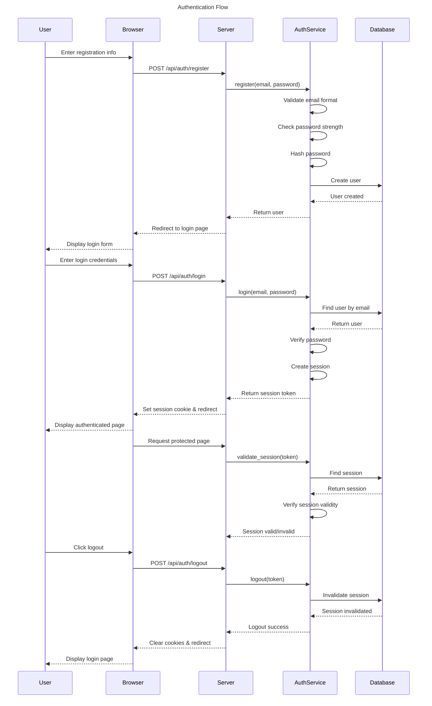

# Authentication Workflow Implementation

## Overview

This document outlines the complete authentication workflow implementation for our Enterprise Application Framework. It covers the entire process from user registration to login, session management, and logout functionality. The implementation follows our architectural principles and security guidelines.

> ℹ️ **Note:** Our project uses Leptos **exclusively in SSR mode** without WebAssembly. All authentication-related UI rendering occurs on the server-side.

## Authentication Flow



## Implementation Components

### 1. Backend Services

#### User Service

The `UserService` handles user-related operations:

```rust
pub struct UserService {
    repository: Arc<dyn UserRepository>,
    jwt_utils: Arc<JwtUtils>,
    session_service: Arc<SessionService>,
    config: Arc<AuthConfig>,
}

impl UserService {
    // Registration
    pub async fn register(&self, create_user: CreateUser) -> Result<User, UserServiceError> {
        // Validate email format
        if !EMAIL_REGEX.is_match(&create_user.email) {
            return Err(UserError::InvalidEmail.into());
        }

        // Check if user already exists
        if (self.repository.find_by_email(&create_user.email).await?).is_some() {
            return Err(UserError::AlreadyExists.into());
        }

        // Validate password strength
        check_password_strength(&create_user.password, &[&create_user.email])?;

        // Hash password
        let password_hash = hash_password(&create_user.password)?;

        // Create user
        let user = User::new(create_user.email, password_hash);
        self.repository.create(&user).await?;

        Ok(user)
    }

    // Login
    pub async fn login(
        &self,
        email: &str,
        password: &str,
        device_id: Option<String>,
        device_fingerprint: Option<DeviceFingerprint>,
        ip_address: Option<String>,
        user_agent: Option<String>,
    ) -> Result<LoginResult, UserServiceError> {
        // Get user by email
        let user = self
            .repository
            .find_by_email(email)
            .await?
            .ok_or(UserServiceError::InvalidCredentials)?;

        // Verify password
        if !verify_password(password, &user.password_hash)? {
            return Err(UserServiceError::InvalidCredentials);
        }

        // Create session with device information
        let metadata = json!({
            "login_type": "password",
            "email": email,
        });

        let (_, session_token) = self
            .session_service
            .create_session(
                user.id,
                device_id,
                device_fingerprint,
                ip_address,
                user_agent,
                Some(metadata),
            )
            .await?;

        Ok(LoginResult {
            user,
            session_token,
        })
    }

    // Logout
    pub async fn logout(&self, session_token: &str) -> Result<(), UserServiceError> {
        self.session_service
            .invalidate_session(session_token, SessionInvalidationReason::UserLogout)
            .await?;
        Ok(())
    }

    // Session validation
    pub async fn validate_session(
        &self,
        session_token: &str,
    ) -> Result<Option<User>, UserServiceError> {
        let session = self.session_service.validate_session(session_token).await?;

        if let Some(session) = session {
            let user = self.repository.find_by_id(session.user_id).await?;
            Ok(user)
        } else {
            Ok(None)
        }
    }
}
```

#### Session Service

The `SessionService` handles session management:

```rust
pub struct SessionService {
    repository: Arc<dyn SessionRepository>,
    jwt_utils: Arc<JwtUtils>,
    config: Arc<AuthConfig>,
}

impl SessionService {
    pub async fn create_session(
        &self,
        user_id: Uuid,
        device_id: Option<String>,
        device_fingerprint: Option<DeviceFingerprint>,
        ip_address: Option<String>,
        user_agent: Option<String>,
        metadata: Option<Value>,
    ) -> Result<(Session, String), SessionServiceError> {
        // Generate random token
        let token = generate_random_token(32)?;
        let token_hash = hash_token(&token)?;
        
        // Calculate expiration time
        let expires_at = SystemTime::now() + self.config.session.session_duration;
        
        // Create session in repository
        let session = self.repository
            .create_session(
                user_id,
                token_hash,
                expires_at,
                device_id,
                device_fingerprint,
                ip_address,
                user_agent,
                metadata,
            )
            .await?;
            
        Ok((session, token))
    }
    
    pub async fn validate_session(
        &self,
        token: &str,
    ) -> Result<Option<Session>, SessionServiceError> {
        // Calculate token hash
        let token_hash = hash_token(token)?;
        
        // Get session by token
        let session = self.repository.get_session_by_token(&token_hash).await?;
        
        // Check if session exists
        let session = match session {
            Some(s) => s,
            None => return Ok(None),
        };
        
        // Check if session is valid
        if !session.is_valid {
            return Ok(None);
        }
        
        // Check if session is expired
        if session.expires_at < SystemTime::now() {
            self.repository
                .invalidate_session(
                    session.id,
                    SessionInvalidationReason::Expired,
                )
                .await?;
            return Ok(None);
        }
        
        // Update last activity if needed
        self.repository
            .update_session_activity(session.id)
            .await?;
            
        Ok(Some(session))
    }
    
    pub async fn invalidate_session(
        &self,
        token: &str,
        reason: SessionInvalidationReason,
    ) -> Result<(), SessionServiceError> {
        // Calculate token hash
        let token_hash = hash_token(token)?;
        
        // Get session by token
        let session = self.repository
            .get_session_by_token(&token_hash)
            .await?
            .ok_or(SessionServiceError::NotFound)?;
            
        // Invalidate session
        self.repository
            .invalidate_session(session.id, reason)
            .await?;
            
        Ok(())
    }
}
```

### 2. API Endpoints

We'll implement the following API endpoints for authentication:

#### Registration Endpoint

```rust
pub async fn register_handler(
    State(state): State<AppState>,
    cookies: Cookies,
    Form(form): Form<RegistrationForm>,
) -> impl IntoResponse {
    // Validate password confirmation
    if form.password != form.password_confirmation {
        return Redirect::to("/register?error=Passwords+do+not+match").into_response();
    }
    
    // Create user
    let create_user = CreateUser {
        email: form.email,
        password: form.password,
    };
    
    // Call user service
    let result = state.user_service.register(create_user).await;
    
    match result {
        Ok(_) => {
            // Registration successful, redirect to login
            Redirect::to("/login?success=Registration+successful").into_response()
        }
        Err(e) => {
            // Registration failed, redirect with error
            let error_message = match e {
                UserServiceError::User(UserError::InvalidEmail) => 
                    "Invalid email format",
                UserServiceError::User(UserError::AlreadyExists) => 
                    "User already exists",
                UserServiceError::Password(PasswordError::TooWeak(_, _)) => 
                    "Password too weak",
                _ => "Registration failed",
            };
            Redirect::to(&format!("/register?error={}", urlencoding::encode(error_message)))
                .into_response()
        }
    }
}
```

#### Login Endpoint

```rust
pub async fn login_handler(
    State(state): State<AppState>,
    cookies: Cookies,
    headers: HeaderMap,
    Form(form): Form<LoginForm>,
) -> impl IntoResponse {
    // Get IP address and user agent
    let ip_address = headers
        .get("X-Forwarded-For")
        .and_then(|v| v.to_str().ok())
        .or_else(|| headers.get("X-Real-IP").and_then(|v| v.to_str().ok()))
        .map(String::from);
        
    let user_agent = headers
        .get(header::USER_AGENT)
        .and_then(|v| v.to_str().ok())
        .map(String::from);
        
    // Generate device fingerprint from headers
    let device_fingerprint = generate_device_fingerprint(&headers);
    
    // Call user service
    let result = state.user_service.login(
        &form.email,
        &form.password,
        None,
        device_fingerprint,
        ip_address,
        user_agent,
    ).await;
    
    match result {
        Ok(login_result) => {
            // Set secure, http-only session cookie
            let mut cookie = Cookie::new(
                state.config.session.cookie_name.clone(),
                login_result.session_token,
            );
            cookie.set_http_only(true);
            cookie.set_secure(true);
            cookie.set_path("/");
            
            if state.config.session.same_site_strict {
                cookie.set_same_site(SameSite::Strict);
            }
            
            cookies.add(cookie);
            
            // Redirect to home page or requested URL
            let redirect_to = form.redirect.unwrap_or_else(|| "/".to_string());
            Redirect::to(&redirect_to).into_response()
        }
        Err(_) => {
            // Login failed, redirect with error
            Redirect::to("/login?error=Invalid+credentials").into_response()
        }
    }
}
```

#### Logout Endpoint

```rust
pub async fn logout_handler(
    State(state): State<AppState>,
    cookies: Cookies,
) -> impl IntoResponse {
    // Get session token from cookie
    if let Some(cookie) = cookies.get(&state.config.session.cookie_name) {
        // Call user service to logout
        let _ = state.user_service.logout(cookie.value()).await;
        
        // Remove cookie
        let mut cookie = Cookie::new(state.config.session.cookie_name.clone(), "");
        cookie.set_http_only(true);
        cookie.set_secure(true);
        cookie.set_path("/");
        cookie.set_max_age(cookie::time::Duration::ZERO);
        
        cookies.add(cookie);
    }
    
    // Redirect to login page
    Redirect::to("/login").into_response()
}
```

#### Session Middleware

```rust
#[derive(Clone)]
pub struct AuthMiddleware<S> {
    service: S,
    user_service: Arc<UserService>,
    config: Arc<AuthConfig>,
}

impl<S> Layer<S> for AuthLayer {
    type Service = AuthMiddleware<S>;

    fn layer(&self, service: S) -> Self::Service {
        AuthMiddleware {
            service,
            user_service: self.user_service.clone(),
            config: self.config.clone(),
        }
    }
}

#[async_trait]
impl<S> Service<Request<Body>> for AuthMiddleware<S>
where
    S: Service<Request<Body>, Response = Response> + Send + Sync + 'static,
    S::Future: Send + 'static,
{
    type Response = S::Response;
    type Error = S::Error;
    type Future = BoxFuture<'static, Result<Self::Response, Self::Error>>;

    fn poll_ready(&mut self, cx: &mut Context<'_>) -> Poll<Result<(), Self::Error>> {
        self.service.poll_ready(cx)
    }

    fn call(&mut self, mut req: Request<Body>) -> Self::Future {
        let service = self.service.clone();
        let user_service = self.user_service.clone();
        let config = self.config.clone();
        
        Box::pin(async move {
            // Extract session token from cookie
            let session_token = req
                .cookies()
                .get(&config.session.cookie_name)
                .map(|c| c.value().to_string());
                
            let mut user = None;
            
            // Validate session if token exists
            if let Some(token) = session_token {
                match user_service.validate_session(&token).await {
                    Ok(Some(u)) => {
                        user = Some(u);
                    }
                    _ => {}
                }
            }
            
            // Add user to request extensions
            if let Some(u) = user {
                req.extensions_mut().insert(AuthUser(u));
            }
            
            // Continue with the request
            service.call(req).await
        })
    }
}

// Helper for protected routes
pub async fn require_auth<B>(
    auth_user: Option<Extension<AuthUser>>,
    req: Request<B>,
    next: Next<B>,
) -> Result<Response, StatusCode> {
    match auth_user {
        Some(_) => {
            // User is authenticated, proceed
            Ok(next.run(req).await)
        }
        None => {
            // User is not authenticated, redirect to login
            let redirect_url = format!(
                "/login?redirect={}",
                urlencoding::encode(&req.uri().to_string())
            );
            Ok(Redirect::to(&redirect_url).into_response())
        }
    }
}
```

### 3. Frontend Integration

#### Protected Page Wrapper

```rust
/// Server-side rendered protected page wrapper
#[component]
pub fn ProtectedPageSSR<F, V>(
    cx: Scope,
    title: String,
    auth_user: Option<User>,
    content_fn: F,
) -> impl IntoView
where
    F: Fn(Scope) -> V + 'static,
    V: IntoView,
{
    if auth_user.is_none() {
        // Not authenticated, render login redirect
        return view! { cx,
            <html>
                <head>
                    <meta http-equiv="refresh" content="0;url=/login" />
                    <title>Redirecting...</title>
                </head>
                <body>
                    <p>Redirecting to login page...</p>
                </body>
            </html>
        };
    }
    
    let user = auth_user.unwrap();
    
    view! { cx,
        <html>
            <head>
                <title>{title} - ACCI Framework</title>
                <link rel="stylesheet" href="/static/styles/main.css" />
            </head>
            <body>
                <NavigationSSR 
                    is_authenticated=true 
                    user_name=Some(user.email.clone()) 
                />
                <main class="container">
                    {content_fn(cx)}
                </main>
            </body>
        </html>
    }
}
```

#### Dashboard Page

```rust
/// Server-side rendered dashboard page
pub async fn dashboard_page(
    State(state): State<AppState>,
    auth_user: Extension<AuthUser>,
) -> impl IntoResponse {
    let renderer = leptos::provide_context(LeptosOptions::default());
    let user = auth_user.0.clone();
    
    leptos::ssr::render_to_string_with_context(
        &renderer,
        move |cx| {
            view! { cx,
                <ProtectedPageSSR
                    title="Dashboard".to_string()
                    auth_user=Some(user)
                >
                    {|cx| view! { cx,
                        <h1>Dashboard</h1>
                        <div class="dashboard">
                            <div class="welcome-card">
                                <h2>Welcome, {user.email.split('@').next().unwrap_or("User")}</h2>
                                <p>You have successfully logged in.</p>
                            </div>
                            <div class="account-info">
                                <h3>Account Information</h3>
                                <ul>
                                    <li>Email: {user.email}</li>
                                    <li>Account Created: {user.created_at.to_string()}</li>
                                    <li>Last Login: {user.last_login.map_or("First login".to_string(), |t| t.to_string())}</li>
                                </ul>
                            </div>
                        </div>
                    }}
                </ProtectedPageSSR>
            }
        }
    ).into_response()
}
```

## Security Measures

### 1. Password Security

- Passwords are hashed using Argon2id with appropriate parameters
- Password strength is checked using zxcvbn library
- Minimum password score is enforced (2 out of 4)
- Common passwords and user information are checked against

### 2. Session Security

- Session tokens are securely generated with cryptographically secure random numbers
- Session tokens are hashed before storage
- Sessions have configurable expiration times
- Session cookies are HttpOnly, Secure, and SameSite=Strict
- Sessions track device information for additional security
- Sessions can be invalidated remotely
- Inactive sessions are automatically cleaned up

### 3. HTTP Security Headers

```rust
pub fn security_headers_layer() -> axum::middleware::from_fn<SecurityHeadersMiddleware> {
    axum::middleware::from_fn(security_headers_middleware)
}

async fn security_headers_middleware<B>(
    req: Request<B>,
    next: Next<B>,
) -> Result<Response, StatusCode> {
    let mut response = next.run(req).await;
    
    let headers = response.headers_mut();
    
    // Content-Security-Policy
    headers.insert(
        header::CONTENT_SECURITY_POLICY,
        HeaderValue::from_static(
            "default-src 'self'; script-src 'self'; style-src 'self'; img-src 'self' data:; \
             connect-src 'self'; font-src 'self'; object-src 'none'; media-src 'self'; \
             frame-src 'none'; frame-ancestors 'none'; form-action 'self'"
        ),
    );
    
    // X-Content-Type-Options
    headers.insert(
        header::X_CONTENT_TYPE_OPTIONS,
        HeaderValue::from_static("nosniff"),
    );
    
    // X-Frame-Options
    headers.insert(
        header::X_FRAME_OPTIONS,
        HeaderValue::from_static("DENY"),
    );
    
    // X-XSS-Protection
    headers.insert(
        HeaderName::from_static("x-xss-protection"),
        HeaderValue::from_static("1; mode=block"),
    );
    
    // Referrer-Policy
    headers.insert(
        header::REFERRER_POLICY,
        HeaderValue::from_static("strict-origin-when-cross-origin"),
    );
    
    // Permissions-Policy
    headers.insert(
        HeaderName::from_static("permissions-policy"),
        HeaderValue::from_static(
            "camera=(), microphone=(), geolocation=(), \
             interest-cohort=()"
        ),
    );
    
    Ok(response)
}
```

### 4. CSRF Protection

```rust
pub struct CsrfToken(String);

pub fn generate_csrf_token() -> CsrfToken {
    let token = generate_random_token(32).unwrap_or_else(|_| {
        // Fallback to less secure but still acceptable method
        use rand::Rng;
        let random_bytes: Vec<u8> = (0..32).map(|_| rand::thread_rng().gen()).collect();
        base64::encode(&random_bytes)
    });
    
    CsrfToken(token)
}

#[derive(Clone)]
pub struct CsrfMiddleware<S> {
    service: S,
    config: Arc<AuthConfig>,
}

#[async_trait]
impl<S> Service<Request<Body>> for CsrfMiddleware<S>
where
    S: Service<Request<Body>, Response = Response> + Send + Sync + 'static,
    S::Future: Send + 'static,
{
    type Response = S::Response;
    type Error = S::Error;
    type Future = BoxFuture<'static, Result<Self::Response, Self::Error>>;

    fn poll_ready(&mut self, cx: &mut Context<'_>) -> Poll<Result<(), Self::Error>> {
        self.service.poll_ready(cx)
    }

    fn call(&mut self, mut req: Request<Body>) -> Self::Future {
        let service = self.service.clone();
        let config = self.config.clone();
        
        Box::pin(async move {
            // Skip CSRF check for safe methods
            let method = req.method().clone();
            if method == Method::GET || method == Method::HEAD || method == Method::OPTIONS {
                return service.call(req).await;
            }
            
            // Skip CSRF check for API endpoints that use other authentication
            let path = req.uri().path();
            if path.starts_with("/api/v1/") {
                return service.call(req).await;
            }
            
            // Check CSRF token
            let cookies = req.cookies();
            let csrf_cookie = cookies.get(&config.csrf.cookie_name);
            
            let csrf_header = req
                .headers()
                .get(&config.csrf.header_name)
                .and_then(|v| v.to_str().ok());
                
            let form_data = req.form_data().await.ok();
            let csrf_form = form_data
                .as_ref()
                .and_then(|data| data.get(&config.csrf.form_field_name))
                .and_then(|v| v.to_str().ok());
                
            let csrf_token = csrf_header.or(csrf_form);
            
            match (csrf_cookie, csrf_token) {
                (Some(cookie), Some(token)) if crypto::secure_compare(cookie.value(), token) => {
                    // CSRF token is valid, proceed
                    service.call(req).await
                }
                _ => {
                    // CSRF token is invalid, return 403
                    Ok(StatusCode::FORBIDDEN.into_response())
                }
            }
        })
    }
}
```

### 5. Rate Limiting

```rust
#[derive(Clone)]
pub struct RateLimitMiddleware<S> {
    service: S,
    limiter: Arc<RateLimiter>,
    config: Arc<AuthConfig>,
}

impl<S> Service<Request<Body>> for RateLimitMiddleware<S>
where
    S: Service<Request<Body>, Response = Response> + Send + Sync + 'static,
    S::Future: Send + 'static,
{
    type Response = S::Response;
    type Error = S::Error;
    type Future = BoxFuture<'static, Result<Self::Response, Self::Error>>;

    fn poll_ready(&mut self, cx: &mut Context<'_>) -> Poll<Result<(), Self::Error>> {
        self.service.poll_ready(cx)
    }

    fn call(&mut self, req: Request<Body>) -> Self::Future {
        let service = self.service.clone();
        let limiter = self.limiter.clone();
        let config = self.config.clone();
        
        Box::pin(async move {
            // Get client IP
            let ip = extract_client_ip(&req);
            
            // Different rate limits for different endpoints
            let path = req.uri().path();
            let method = req.method().clone();
            
            let limit = if path == "/api/auth/login" && method == Method::POST {
                config.rate_limit.login_attempts
            } else if path == "/api/auth/register" && method == Method::POST {
                config.rate_limit.registration_attempts
            } else {
                return service.call(req).await;
            };
            
            // Check rate limit
            match limiter.check_limit(ip, path, limit).await {
                Ok(_) => {
                    // Under limit, proceed
                    service.call(req).await
                }
                Err(wait_time) => {
                    // Rate limit exceeded
                    let mut response = Response::new(Body::empty());
                    *response.status_mut() = StatusCode::TOO_MANY_REQUESTS;
                    
                    response.headers_mut().insert(
                        header::RETRY_AFTER,
                        HeaderValue::from_str(&wait_time.as_secs().to_string())
                            .unwrap_or_default(),
                    );
                    
                    Ok(response)
                }
            }
        })
    }
}
```

## Testing Strategy

### 1. Unit Tests

Each component of the authentication system should have comprehensive unit tests:

- Password hashing and validation
- Email validation
- JWT token generation and validation
- User service methods
- Session service methods

### 2. Integration Tests

Integration tests should cover the complete authentication flow:

- User registration with valid and invalid data
- User login with valid and invalid credentials
- Session validation and expiration
- Logout functionality

### 3. Security Tests

Security-specific tests should verify:

- Password strength enforcement
- Rate limiting functionality
- CSRF protection
- Session invalidation
- Security headers

## Implementation Schedule

### Week 1: Core Authentication Backend

- [x] Implement user models and repository
- [x] Create password utilities (hashing, validation)
- [x] Implement basic user service
- [x] Add email validation

### Week 2: Session Management

- [x] Implement session models and repository
- [x] Create session service
- [x] Add JWT utilities
- [x] Implement session validation and invalidation

### Week 3: API Integration

- [ ] Create API endpoints for authentication
- [ ] Implement security middleware (CSRF, rate limiting)
- [ ] Add security headers
- [ ] Create authentication middleware

### Week 4: Frontend Integration

- [ ] Implement server-side rendered pages using Leptos
- [ ] Create login and registration forms
- [ ] Add protected page wrapper
- [ ] Implement dashboard page

### Week 5: Testing and Security Audit

- [ ] Write comprehensive unit tests
- [ ] Create integration tests
- [ ] Perform security audit
- [ ] Fix any identified issues

## Conclusion

This authentication implementation provides a secure, robust foundation for our Enterprise Application Framework. It follows industry best practices for security while maintaining good performance and user experience.

By implementing the complete authentication workflow as described in this document, we'll have a solid foundation for building the rest of the application's functionality. The server-side rendering approach with Leptos ensures that our application is secure and performs well, even without client-side WebAssembly execution.

Remember that all frontend rendering is done server-side, which provides better security and initial load performance at the cost of more interactive UI experiences. This tradeoff aligns with our project goals of prioritizing security and maintainability.
